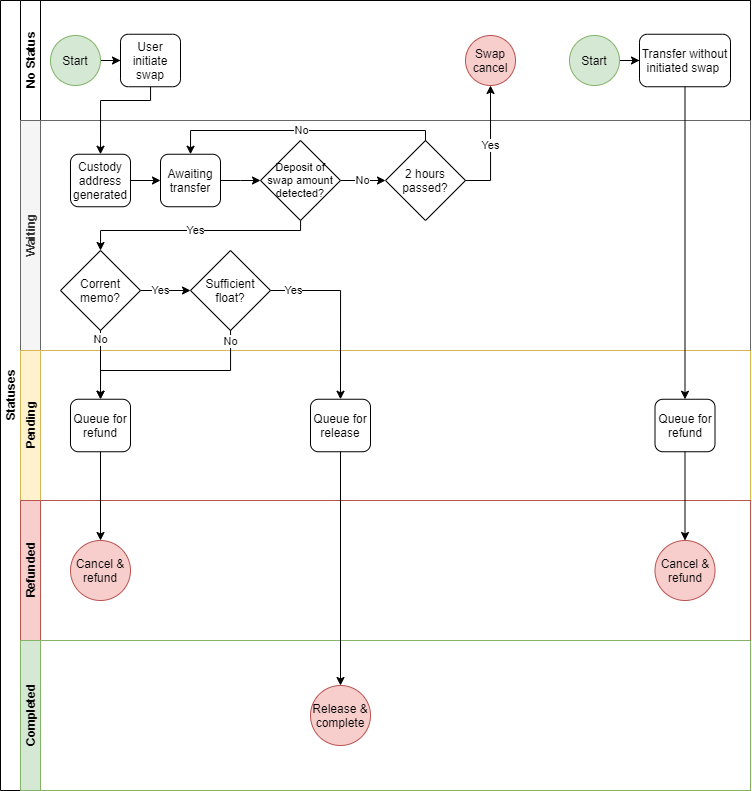

# [⏎](./readme.md) SWIP-002: Swap Process for BTC → BTC.B

# Summary

Definition of Skybridge Swap flows of BTC → BTC.B
This SWIP defines the process flow of BTC → BTC.B

# Motivation

Swingby Node has a logic of coin swap between cross-chain.
This logic is optimized to receive and process BTC transactions.

# Status

Deployed.

# Specification

Following the steps is Skybridge Swap flows the case of BTC → BTC.B

1. User tells Swingby the amount and dest. address on website
2. Swingby tells user the real amount to send
3. Swingby peer validates BNB address and params, saves amount and address in K/V
4. User confirms address stored in K/V from a different peer (UI asks another peer)
5. When peers see the incoming TX, K/V pair is moved to confirmed table. The incoming TX must meet a confirmation requirement (e.g. 3 on BTC, 1 on BNB)
6. IF not found, coins are returned, otherwise swap happens.

### Diagram

## Pre-requisites

None

## Details

None

# License

Copyright (c) 2020 Swingby Labs Pte. LTD. The text content of this specification file is licensed under an MIT license found in the root of this repository.
